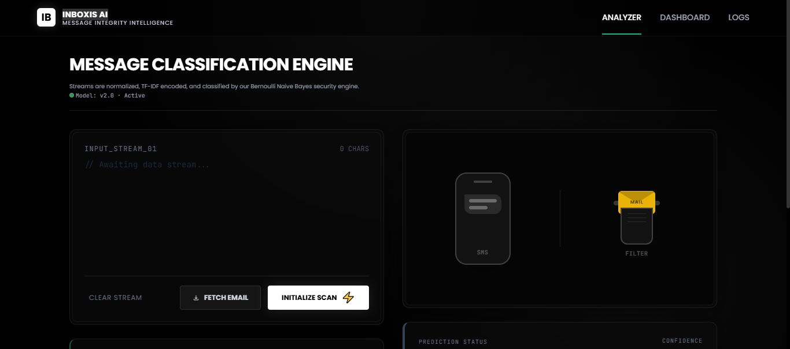

# 🚨 INBOXIS AI — Message Integrity Intelligence Console

> **INBOXIS AI is a high-fidelity message classification system designed to inspect, decode, and evaluate raw email and SMS streams. It moves beyond simple spam detection by acting as a content-integrity interface, exploring how organizations monitor inbound communications for security threats and toxicity.**

---

## **Live Application**

**A fully deployed version of ***INBOXIS AI (v2.0)*** is available for interactive exploration.**

**Explore real-time classification, toxicity shielding, Bernoulli NB inference, and the comprehensive analytical dashboard.**

---

## **🎯 Objective**

To demonstrate a robust approach to message security using classical ML, focusing on **interpretability, system observability, and user trust** through a polished, console-style interface.

---

## **🛠 Tech Stack**

- **Engine:** Bernoulli Naive Bayes + TF-IDF Vectorization for lightweight, high-precision binary classification.
- **Backend:** Flask (Python) managing inference and model serialization via Pickle.
- **Frontend:** TailwindCSS, GSAP for micro-interactions, and Chart.js for dashboard analytics.
- **Persistence:** Zero-backend persistence; strictly using browser localStorage for local logging and privacy.

---

## **🚀 Implementation Highlights**

- **Architectural Pragmatism:** Intentionally utilizes a Naive Bayes framework to ensure sub-millisecond latency and maintain high interpretability for short-form message domains.
- **Toxicity Shielding:** Integrated a controlled profanity-flagging pipeline that simulates real-world "quarantining" and "auto-clean" recovery behaviors for incoming data.
- **Deterministic Evaluation:** Uses a structured sample-injection system to simulate realistic HR scams and professional communications for consistent system testing and evaluation.

---

## **📖 Comprehensive Documentation**

#### **For a deep dive into the system philosophy, mathematical logic, and the "System-First" design intent:**

[👉 Read Technical Deep Dive](./Technical_Deep_Dive.md)

---

# 🖥 System Interface Preview

**INBOXIS AI Interface**

---

## **👤 Author**

**Nayan Darokar**

**Aspiring Data Scientist — Intelligent Interfaces & ML Systems Engineering**

> **Connect With Me Here:**

 

