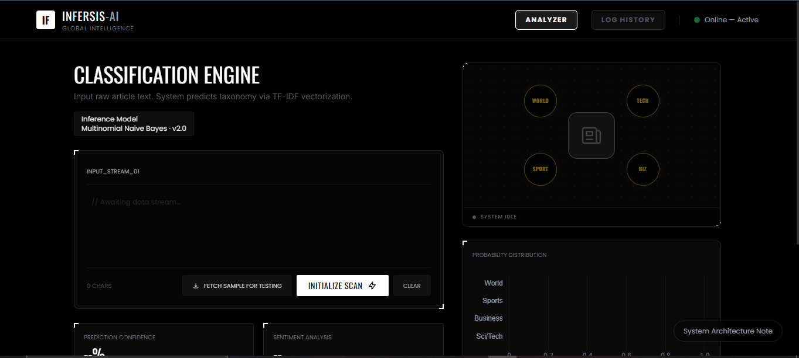

# 📰 INFERSIS AI — News Intelligence & Category Classification Console

> **INFERSIS AI is a high-fidelity news taxonomy and content-intelligence console. It is designed to act as a structured operator interface, exploring how media data can be monitored, categorized, and contextualized through automated NLP pipelines.**

---

## **Live Application**

**Access the high-fidelity build of ***INFERSIS AI***, a news taxonomy and content-intelligence system.**

**Evaluate topic classification, sentiment context, probability distributions, and the comprehensive analytical console.**

---

## **🎯 Objective**

To demonstrate a robust NLP pipeline that elevates classical news classification into a comprehensive analytical tool, focusing on **observability, content density awareness, and system traceability.**

---

## **🛠 Tech Stack**

- **Engine:** Multinomial Naive Bayes + TF-IDF Vectorization for high-speed, deterministic taxonomy.
- **Analytics:** Integrated Sentiment Analysis and frequency-based keyword/entity extraction.
- **Backend:** Flask (Python) modernized from an initial prototype for granular state control and improved performance.
- **Frontend:** TailwindCSS & Chart.js, featuring a "Scan Initialization" workflow to simulate real-world data orchestration.
- **Persistence:** Time-bounded local retention (7 days) using browser localStorage for zero-leak privacy.

---

## **🚀 Implementation Highlights**

- **Operational Realism:** Unlike static demos, the UI features live system status indicators (Idle → Scanning → Complete) to reflect the stages of data processing latencies.
- **Hybrid Intelligence:** Surfaces secondary signals (sentiment trends and word-count density) to provide a 360-degree view of the content beyond the primary category.
- **Sample Ingestion Pipeline:** Includes a governed sample-injection system from curated sources to support consistent system evaluation and analytical testing.

---

## **📖 Comprehensive Documentation**

#### **For a deep dive into the system taxonomy, NLP logic, and the transition from prototype to structured architecture:**

[👉 Read Technical Deep Dive](./Technical_Deep_Dive.md)

---

# 🖥 System Interface Preview

**INFERSIS AI Operator Console**

---

# **👤 Author: Nayan Darokar** > **Data Scientist (Aspiring) | Intelligent Systems & Applied ML Engineering**

---

> **Connect With Me Here:**

 

