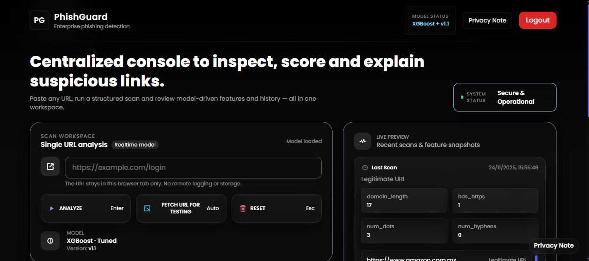

# **🚀 PhishGuard — Intelligent URL Phishing Detection System**

> **Advanced ML-powered phishing detection with layered security heuristics, real-time analysis, and an enterprise-grade UI.**

---

## **Live Application**

**The operational deployement of ***PhishGuard Intelligence*** is available for direct usage.**

**Test URL classification, real-time threat scoring, vectorized feature analysis, and the security-focused intelligence console**


**🔗 Visit Live App:**

🔗 **Visit Live App:** [](https://phishguard-intelligence.onrender.com)


---

# **Dataset Source:**
```bash
https://data.mendeley.com/datasets/vfszbj9b36/1 
```
> ***This project utilizes the Phishing URL Dataset published on Mendeley Data under the CC BY 4.0 license. Full credit goes to the original authors for creating and sharing the dataset. Their openly licensed work made the development of this phishing detection system possible.***

---

# **🧩 Overview**

> **PhishGuard is a high-confidence phishing detection platform built on a hybrid security architecture that combines:**

- **Machine Learning (XGBoost) trained on real phishing datasets**
- **Dynamic feature extraction from URL structure**

- **Heuristic detection layers such as typosquatting checks, suspicious keyword patterns, and TLD risk scoring**

- **Large curated allowlist of legitimate global & Indian domains**

- **Real-time inference through a modern, premium UI built with TailwindCSS + custom components**

- **The system delivers fast, explainable, and privacy-aware predictions suitable for demonstrations, engineering evaluations, and early-stage enterprise security integrations.**

---


## **🎯 Design Intent & Project Philosophy**

> **In applied data science and machine learning, many projects often converge on the same datasets, models, and evaluation metrics.**  

> **While model performance remains important, real-world impact depends equally on how insights are communicated, explored, and trusted**.

> **The deliberate focus on a **polished, system-level UI** in this project was intentional.**

> **Beyond model accuracy, this project was an opportunity to go beyond standard implementations and invest additional effort into **presentation, interaction, and system completeness** — areas that are frequently underrepresented in academic or tutorial-style projects.**

### **The design choices were made to:**

> **Reflect how ML insights are consumed inside real organizations through dashboards and internal tools rather than notebooks.**

> **Demonstrate that applied data science involves **product thinking**, not only algorithm selection.**

> **Treat explainability and user trust as first-class concerns rather than optional additions.**

> **Elevate the project from a typical model demonstration to a complete, user-facing intelligence system.**

> **This philosophy aligns with the belief that **engineers who aim to grow beyond baseline implementations must be willing to invest extra effort where it meaningfully improves clarity, usability, and trust**, not only raw metrics.Production-facing ML systems succeed when interpretability, usability, and engineering discipline receive the same level of attention as accuracy.**


---

# **🔍 Key Features**

#### **1. ML-Based Phishing Classification**

> **A trained XGBoost classifier evaluates each URL using engineered features such as:**

- **URL length**

- **Domain length**

- **Slash / hyphen / dot count**
- **HTTPS presence**
- **Path entropy indicators**

---

#### **2. Multi-Layer Security Heuristics**

> **This reduces false positives from high-traffic legitimate domains.**

---

#### **Typosquatting Detector**

> **Identifies obfuscated variants of major domains, such as:**
- **g00gle / go0gle**
- **faceb00k**
- **amaz0n**
- **Common homograph substitutions**

---

#### **✔ High-Risk TLD Classifier**

> **Flags suspicious TLDs frequently used in phishing operations:**

- **.xyz, .top, .click, .shop, .buzz, .rest, .cyou, .ml, .tk, .cf, .vip, .win …and many more.**

---

#### **✔ Suspicious Pattern Scanning**

> **Regex-based detection for common phishing patterns:**

- **Account verification traps**
- **Billing/payment fraud**
- **Login reset scams**
- **Crypto wallet impersonation**

---

#### **3. Privacy-First Architecture**

> **No URLs are logged or stored.**
> **Inference runs locally within the session.**

---

#### **4. Secure User Authentication System**

> **PhishGuard includes a built-in authentication layer powered by SQLite to support controlled access and user identity management.**

- **Secure user registration & login**
- **Session-based access control**
- **Guest mode with timed expiry**
- **Foundation for future role-based access (Admin / Analyst / User)**

---

# **🛠 Tech Stack**

#### **Backend**

- **Python 3**
- **Flask**
- **Joblib (model loading)**
- **Pandas**
- **Regex / urllib.parse**
- **SQLite (User authentication & session management)**


---

# **🛠 Model**

- **Tuned XGBoost.pkl**  
- **Trained on mixed phishing & legitimate URL datasets**

---

# **📂 Project Structure**

| File / Folder                                | Description                                               |
|----------------------------------------------|-----------------------------------------------------------|
| `app.py`                                     | Core backend with ML inference + security heuristics      |
| `Dockerfile`                                 | Docker configuration file for containerizing the app      |
| `requirements.txt`                           | Python dependencies list for the project                 |
| `Dataset/`                                   | Dataset folder                                            |
| ├── `Phishing URLs.csv`                      | Phishing dataset                                          |
| └── `URL dataset.csv`                        | Legitimate URL dataset                                    |
| `Model/`                                     | Model storage folder                                      |
| └── `tuned_xgb_phishing_model.pkl`           | Tuned XGBoost phishing detection model                    |
| `Output/`                                    | Output assets folder                                      |
| └── `UpdatedUI.png`                                 | UI screenshot for README                                  |
| `templates/`                                 | HTML templates directory                                  |
| ├── `index.html`                             | Premium responsive UI                                     |
| └── `result.html`                            | Result view (optional / secondary template)               |
| `PhishGuard-Advanced-URL-Detector.ipynb`     | Jupyter notebook for full model workflow                  |
| `README.md`                                  | Project documentation                                      |
| `LICENSE`                                    | Apache License 2.0                                        |

---

# **⚙️ Installation & Setup**

> **1. Install dependencies**

```bash 
pip install flask pandas joblib scikit-learn
```

---

> **2. Run the application**

```bash 
python app.py
```

---

> **3. Open the browser**

```bash 
http://127.0.0.1:5000

```

---

# **🧠 Detection Pipeline**

- **Input URL received**
- **Protocol validation (http:// or https://)**
- **Allowlist keyword scan**
- **Suspicious regex pattern detection**
- **High-risk TLD scoring**
- **ML model inference (only if previous layers don’t classify it)**
- **Explainable output returned to UI**

> **This layered approach emulates real-world security products, reducing false positives and strengthening detection accuracy.**

---


# **🔒 Security Considerations**

- **The ML model is only as good as the datasets used**
- **No actual threat analysis is performed on webpages**
- **Not intended as a primary cybersecurity product**
- **Ideal for learning, prototyping, and demonstrating phishing detection logic**
- **Includes a lightweight authentication system for demonstrating controlled access and secure user workflows in phishing analysis platforms.**


----

# **🌐 Dataset Sources**

> **The system consumes:**

- **Public phishing URL datasets**
- **Legitimate mixed domain datasets**
- **Curated allowlist created from global & Indian trusted websites**

---

# **🤝 Acknowledgments**

**This project blends ML, security heuristics, and modern UI engineering.** 
**The allowlist, heuristics, and overall design concept were created during development, with GPT used only for expanding the keyword list.**

---

# **Output**



---

# **🏁 Conclusion**

> **PhishGuard offers a modern, intelligent, multi-layer phishing detection system with both practical ML components and engineered heuristics. It provides a polished experience suitable for demos, portfolios, teaching, and early-stage security engineering work.**


---

## **Source Availiability**

> **The core source implementation for this project is maintained in a private repository.**

> **The code can be shared upon request for review or evaluation purposes.**


---

## 📜 License

This project is open-source and licensed under the [Apache License 2.0](LICENSE).
See the LICENSE file for full details.

---

# **👤 Author:  Nayan Darokar** 
> **Data Scientist (Aspiring) | Intelligent Systems & Applied ML Engineering**

---

> **Connect With Me Here:**

[](https://www.linkedin.com/in/nayan-darokar-468a85294/) 
[](mailto:reachout.nayan@gmail.com)
[](https://nayan-portfolio-nine.vercel.app/)
