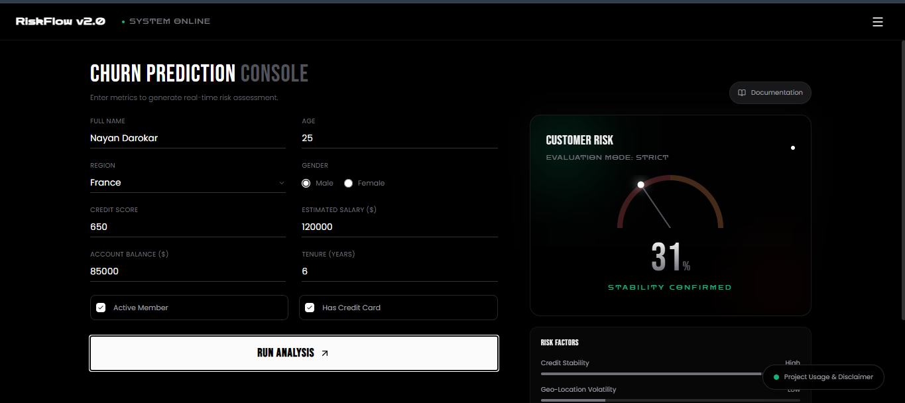

# 📈 RiskFlow v2.0 — High-Fidelity Customer Churn Intelligence

> **RiskFlow v2.0 is a high-fidelity analytical console designed to explore how modern financial datasets can be utilized to evaluate churn risk and surface interpretable insights. It is architected as a complete analytical interface, focusing on the transition from predictive modeling to a functional system environment.**

---

## **Live Application**
**The operational deployment of RiskFlow v2.0 is available for interactive risk evaluation.**

**Explore probabilistic churn forecasting, geographic segmentation, and the "TensorFlow-less" optimized inference engine.**

---

## **🎯 Objective**

To demonstrate a robust churn intelligence workflow that prioritizes **system observability, deployment optimization, and explainable risk scoring** through a modular, high-fidelity interface.

---

## **🛠 Tech Stack**

- **Inference Engine:** Gradient Boosting Classifier + Pretrained StandardScaler for high-precision binary classification (EXIT vs STAY).
- **Optimization:** Developed a custom **"TensorFlow-less" inference method** using raw NumPy weight extraction to maintain a low memory footprint (<500MB RAM).
- **Backend:** Flask (Python) with serialized model artifacts via Joblib.
- **Frontend:** TailwindCSS, Chart.js with DataLabels, and Glassmorphism-based UI components.
- **Persistence:** Zero server-side persistence; utilizing **browser localStorage** for persistent historical logging.

---

## **🚀 Implementation Highlights**

- **Architectural Optimization:** While a Deep Learning version exists, this build leverages a lean ML framework to ensure stability on resource-constrained cloud environments (Render Free Tier).
- **Deterministic Orchestration:** Features a simulation framework that decouples UI behavior from backend constraints, allowing for consistent, high-fidelity demonstrations of churn scenarios.
- **Multi-Layer Analytics:** Surfaces risk through a probability-calibrated gauge, geographic distribution charts, and per-customer analytical report modals for deep-dive inspection.

---

## **📖 Comprehensive Documentation**

#### **For a deep dive into the NumPy weight extraction logic, feature normalization, and the research-based interface design:**

[👉 Read Technical Deep Dive](./Technical_Deep_Dive.md)

---

# 🖥 System Interface Preview

**RiskFlow v2.0 Analysis Console**

---

## **👤 Author: Nayan Darokar**

#### **Aspiring Data Scientist — Intelligent Interfaces & ML Systems Engineering**

---

> **Connect With Me Here:**

 

