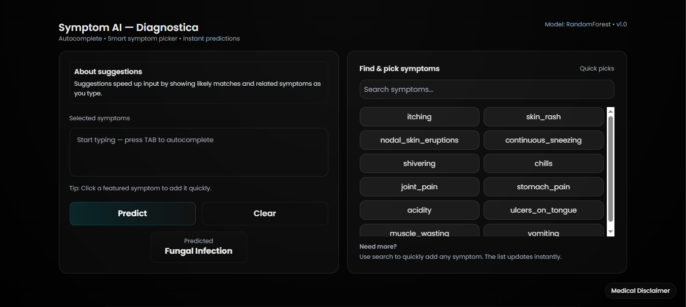

# **🚀 Symptom AI — Diagnostica**  

> **Intelligent Symptom-Based Disease Prediction System.**  

> **Advanced ML-powered medical condition prediction with smart symptom intelligence, real-time analysis, and a modern healthcare-focused UI.**

> **Note :This project does not include the dataset or trained ML model due to size limitations. A link to the original dataset source is provided below.**

---

## **Live Application**

**Experience the real-time medical symptom intelligence engine, where structured health indicators, auto-completion suggestions and a modern UI diagnostic interface.**

[](https://symptom-ai-daignostica.onrender.com)


---

# **Dataset Source:**  

> **This project utilizes the Symptom–Disease Dataset published on Mendeley Data (Elsevier), a peer-reviewed academic repository. Full credit belongs to the original authors whose open dataset enabled this system.**

```bash
https://data.mendeley.com/datasets/dv5z3v2xyd/1
```

---

# **🧩 Overview**

- **Symptom AI — Diagnostica is a smart, interactive disease prediction platform built on a machine learning-driven diagnostic architecture combining:**  

- **Random Forest classification model trained on symptom–disease relationships**  

- **Context-aware autocomplete for efficient symptom entry**  

- **Related symptom recommendation based on co-occurrence patterns**  

- **Quick-pick symptom panel for rapid selection**  

- **Real-time prediction engine with responsive UI**  

- **Modern glassmorphism interface powered by Tailwind CSS**  

> **Designed for academic use, ML demonstrations, HealthTech prototypes, and portfolio projects.**

---

# **🔍 Key Features**

**1. ML-Based Disease Classification**

- **Random Forest model predicts medical conditions using encoded multi-label symptom data.**  

- **Symptom vectorization and encoding pipeline**  

- **Probability-based disease inference**

---

**2. Intelligent Symptom Assistance**

- ✔ **Smart Autocomplete Input**  

- **Inline faded suggestions appear as you type. Press TAB to autocomplete.**

- ✔ **Related Symptom Recommender**  

- **Suggests commonly associated symptoms improving prediction accuracy.**

- ✔ **Quick-Pick Symptoms Panel**  

- **Side panel with commonly used symptoms for rapid input.**

- ✔ **Instant Prediction Output**  

- **Results displayed immediately upon submission.**

- **Clear Input Button**  

- **One-click reset for all fields and results.**

- **3. Responsive & Modern UI**

- **Built with Tailwind CSS and custom glassmorphism styling optimized for desktop and mobile.**

---


## **🎯 Design Intent & Project Philosophy**

> **In applied data science and machine learning, many projects often converge on the same datasets, models, and evaluation metrics.**  

> **While model performance remains important, real-world impact depends equally on how insights are communicated, explored, and trusted**.

> **The deliberate focus on a **polished, system-level UI** in this project was intentional.**

> **Beyond model accuracy, this project was an opportunity to go beyond standard implementations and invest additional effort into **presentation, interaction, and system completeness** — areas that are frequently underrepresented in academic or tutorial-style projects.**

### **The design choices were made to:**

> **Reflect how ML insights are consumed inside real organizations through dashboards and internal tools rather than notebooks.**

> **Demonstrate that applied data science involves **product thinking**, not only algorithm selection.**

> **Treat explainability and user trust as first-class concerns rather than optional additions.**

> **Elevate the project from a typical model demonstration to a complete, user-facing intelligence system.**

> **This philosophy aligns with the belief that **engineers who aim to grow beyond baseline implementations must be willing to invest extra effort where it meaningfully improves clarity, usability, and trust**, not only raw metrics.Production-facing ML systems succeed when interpretability, usability, and engineering discipline receive the same level of attention as accuracy.**


---

# **🛠 Tech Stack**

**Frontend**

- **HTML**  

- **Tailwind CSS**  

- **JavaScript**

**Backend**

- **Python**  

- **Flask**

**Machine Learning**

- **Random Forest**  

- **Pandas**  

- **NumPy**  

- **Multi-label symptom encoding**

---

# **📂 Project Structure**

| **File / Folder**                                   | **Description**                                              |
|---------------------------------------------------|--------------------------------------------------------------|
| `app.py`                                          | Core Flask backend with disease prediction logic            |
| `Dockerfile`                                      | Docker configuration file for containerizing the app        |
| `requirements.txt`                                | Python dependencies list for the project                    |
| `Dataset/`                                       | Dataset folder                                              |
| └── `symbipredict_2022.csv`                      | Symptom-based disease dataset used for training             |
| `Models/`                                        | Model storage directory                                     |
| ├── `rf_model.pkl`                               | Trained Random Forest disease prediction model              |
| └── `symptom_columns.pkl`                       | Encoded symptom feature mapping for model input             |
| `Output/`                                       | Output assets folder                                        |
| ├── `UI.png`                                    | Main UI screenshot for README                               |
| └── `ResponsiveUI.png`                          | Responsive UI preview (mobile view)                         |
| `templates/`                                    | HTML templates directory                                    |
| └── `index.html`                               | Primary responsive frontend interface                      |
| `SYMPTOM-BASED-DISEASE-PREDICTION.ipynb`       | Jupyter notebook containing full ML workflow                |
| `README.md`                                     | Project documentation                                       |
| `LICENSE`                                       | Open-source license file                                    |


---

# **⚙️Instructions & Setup**

**1. Download Dataset**  

- **Use the dataset link provided above.**

**2. Train the ML Model**  

- **Preprocess and train your ML model (XGboost Recommended).**  

**3. Save Model & Encoders**  

- **Save the trained model and encoders in the project directory.**  

**4. Update the model paths in `app.py` if needed.**

**5. Install Dependencies**

```bash
pip install flask pandas numpy scikit-learn
```

**6. Run the Application**
```bash
cd DISEASE-PREDICTION-USING-SYMPTOMS-main
python app.py
```

**7. Open Browser**
```bash
- **http://127.0.0.1:5000**
```

---

# **🧠How it Works**

- **User enters symptoms manually or via autocomplete**  

- **System suggests related symptoms dynamically**  

- **Input is vectorized and encoded**  

- **Random Forest model predicts disease**  

- **Prediction is displayed in the UI**  

> **Simulates intelligent early-stage diagnostic support systems.**

---

# **🩺 Use Cases**

- **Patients — Early symptom awareness**  

- **Students — ML healthcare experimentation**  

- **Developers — Flask + ML integration learning**  

- **HealthTech — Prototype diagnostic modules**

---

# **🔒 Important Considerations**

- **Not intended as medical advice**  

- **Accuracy depends on dataset quality**  

- **Not suitable for clinical diagnosis**  

- **For educational and experimental use only.**

---

# **🎯 Purpose**

- **To simplify symptom-based disease detection through an intelligent and user-friendly machine learning interface.**

---

# **🖥 Output**
  


---


# **🏁 Conclusion**

- **Symptom AI — Diagnostica presents a modern, intelligent, and practical disease prediction platform combining smart symptom intelligence with machine learning precision. Ideal for projects, demos, and healthcare AI learning.**

---

## **Source Availiability**

> **The core source implementation for this project is maintained in a private repository.**

> **The code can be shared upon request for review or evaluation purposes.**


---

# **📜 License**

> **This project is open-source and licensed under the [Apache License 2.0](../LICENSE).**
> **See the LICENSE file for full details.**

---
# **👤 Author:  Nayan Darokar** 
> **Data Scientist (Aspiring) | Intelligent Systems & Applied ML Engineering**

---

> **Connect With Me Here:**

[](https://www.linkedin.com/in/nayan-darokar-468a85294/) 
[](mailto:reachout.nayan@gmail.com)
[](https://nayan-portfolio-nine.vercel.app/)


