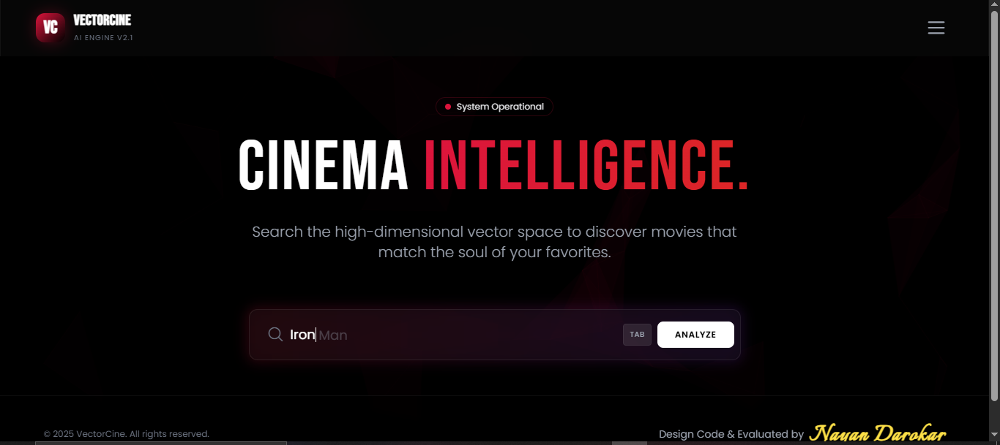

# **🎬 VectorCine AI — Cinematic Intelligence & Vector Similarity Engine**

> **VectorCine AI is a production-styled cinematic intelligence system designed to explore, evaluate, and recommend films by navigating a high-dimensional vector similarity space through a real-time, system-oriented interface.**

> **Rather than presenting recommendations as a static list, VectorCine AI is intentionally architected as an internal intelligence console — reflecting how recommendation engines are queried, monitored, and trusted inside modern ML-driven products.**

---
# 🎬 VectorCine AI — Cinematic Intelligence & Vector Similarity Engine

> [!TIP]
> **In a hurry?** For a high-level overview of the vector architecture, engineering highlights, and deployment strategy, please refer to the **[Executive Summary (README.md)](./README.md)**.

---

## **Deployment Status**

> **This project was initially deployed on Render (free tier). While the application starts correctly, the size of the precomputed vector artifacts (~190MB) combined with free-tier memory and download constraints causes worker restarts and gateway errors under real usage.**

> **Rather than exposing an unstable public endpoint, the live deployment has been intentionally disabled.**

> **The complete system — including model loading, similarity computation, API endpoints, and frontend integration — works correctly in local and properly provisioned environments (Docker / VPS / cloud instances).**

> **This decision prioritizes correctness, transparency, and engineering best practices over a misleading demo.**

---

## Engineering Learnings

- **Deployment constraints are as critical as model accuracy**
- **Free-tier platforms are often unsuitable for large ML artifacts**
- **Stability and transparency are more important than forced demos**
- **ML systems require different infrastructure decisions than typical web apps**

---

# **Dataset Source:**
```bash
https://www.kaggle.com/datasets/tmdb/tmdb-movie-metadata
```

> ***This project utilizes the TMDB 5000 Movie Metadata dataset made available on Kaggle. The dataset contains detailed information about movies, including titles, genres, cast, crew, and descriptive metadata. Full credit goes to the original dataset creators and The Movie Database (TMDB) for collecting and publishing this data. The availability of this dataset enabled the development, training, and demonstration of the VectorCine movie recommendation system presented in this project.***

---

## **🧩 Overview**

> **VectorCine AI analyzes semantic relationships between films using precomputed vector embeddings and cosine similarity to surface recommendations that align with the contextual “essence” of a selected title.**

> **The system places equal emphasis on algorithmic relevance, interaction discipline, and observability — elevating a classical content-based recommender into a product-grade intelligence experience.**

> **This project prioritizes system realism, UX clarity, and architectural intent over experimental novelty.**

---

    
## **🎯 Design Intent & Project Philosophy**

> **In applied data science and machine learning, many projects often converge on the same datasets, models, and evaluation metrics.**  

> **While model performance remains important, real-world impact depends equally on how insights are communicated, explored, and trusted**.

> **The deliberate focus on a **polished, system-level UI** in this project was intentional.**

> **Beyond model accuracy, this project was an opportunity to go beyond standard implementations and invest additional effort into **presentation, interaction, and system completeness** — areas that are frequently underrepresented in academic or tutorial-style projects.**

### **The design choices were made to:**

> **Reflect how ML insights are consumed inside real organizations through dashboards and internal tools rather than notebooks.**

> **Demonstrate that applied data science involves **product thinking**, not only algorithm selection.**

> **Treat explainability and user trust as first-class concerns rather than optional additions.**

> **Elevate the project from a typical model demonstration to a complete, user-facing intelligence system.**

> **This philosophy aligns with the belief that **engineers who aim to grow beyond baseline implementations must be willing to invest extra effort where it meaningfully improves clarity, usability, and trust**, not only raw metrics.Production-facing ML systems succeed when interpretability, usability, and engineering discipline receive the same level of attention as accuracy.**

---

## **🧠 Core Capabilities**

#### **1. Vector-Based Recommendation Engine**

- **Precomputed high-dimensional movie embeddings**

- **Cosine similarity–based deterministic ranking**

- **Low-latency inference suitable for interactive querying**

- **Top-K recommendation retrieval**

- **Similarity confidence expressed as interpretable percentages**

---

#### **2. IDE-Inspired Ghost Autocomplete System**

> **Designed to reduce user friction and hesitation during query input**

- **Real-time prefix-based title matching**

- **Ghost text overlay inspired by modern IDEs**

- **TAB-to-complete on desktop**

- **Tap-to-accept behavior on mobile**

- **Single-suggestion governance to avoid cognitive overload**

---

#### 3. High-Fidelity Recommendation Visualization

- **Card-based recommendation layout**

- **Animated ranking reveal**

- **Confidence bars synchronized with similarity scores**

- **Consistent visual language aligned with portfolio identity**

- **Staged transitions to preserve perception of intelligence**

---

#### **4. System Analytics & Intelligence Dashboard**

> **A secondary console designed to simulate operational visibility**

- **Indexed movie count disclosure**

- **Vector dimensionality visibility**

- **Session-level query monitoring**

- **Cosine similarity effectiveness indicator**

- **Neural activity density visualization (simulated)**

- **Memory & CPU resource indicators**

- **Structured event log timeline**

> **Dashboard metrics are intentionally illustrative, reinforcing system awareness without implying live telemetry.**

---

#### **5. Controlled User Flow & Feedback Governance**

- **Explicit “Analyze” action**

- **Staged loader states with artificial latency**

- **Clear error boundaries for invalid inputs**

- **View-level separation between engine and analytics**

- **Predictable UI behavior to reinforce trust**

---

#### **🧠 Model & Architecture Context**

> **VectorCine AI employs a classical content-based recommendation architecture refined through disciplined system engineering.**

#### **Key Architectural Decisions**

- **Precomputed similarity matrix for instant retrieval**

- **Pickle-serialized artifacts loaded at runtime**

- **Google Drive–backed model delivery via environment variables**

- **Flask backend for deterministic routing and inference**

- **Frontend-orchestrated intelligence perception**

> ***NOTE:*** **Transformer-based recommenders were intentionally excluded in this iteration to preserve interpretability, speed, and deployment simplicity.**

> **The architecture supports future embedding upgrades without interface changes.**

---

## **🔒 Privacy & Data Handling**

- **No user data storage**

- **No session persistence**

- **No cookies or analytics trackers**

- **No external API calls for inference**

- **All computation remains ephemeral and request-scoped**

> **VectorCine AI provides probabilistic similarity signals — not editorial or factual recommendations.**

---

## **🛠 Tech Stack**

#### **Backend**

- **Python 3.11**
- **Flask**
- **Scikit-learn**
- **Pandas**
- **NumPy**
- **Pickle-serialized models**
- **GDown (Google Drive artifact loading)**
- **Gunicorn**

#### **Frontend**

- **HTML5**
- **Tailwind CSS (custom-configured)**
- **Vanilla JavaScript**
- **Canvas-based network animation**
- **Custom interaction logic (ghost input, staged loaders)**


#### **Deployment**

- **Docker**
- **Render**
- **Environment-variable–driven configuration**

---

## **📂 Project Structure**


| File / Folder                                | Description                                                     |
|---------------------------------------------|-----------------------------------------------------------------|
| `app.py`                                    | Core Flask backend handling routing, inference, and autocomplete |
| `Dockerfile`                                | Docker configuration for containerized deployment               |
| `requirements.txt`                          | Python dependency manifest                                      |
| `.env`                                      | Environment variables for local development                     |
| `.env.example`                              | Environment variable template                                   |
| `.gitignore`                                | Git ignore rules                                                 |
| `README.md`                                 | Product-level system documentation                              |
| `LICENSE`                                   | Apache License 2.0                                              |
|                                             |                                                                 |
| `Data/`                                     | Dataset directory                                               |
| ├── `tmdb_5000_movies.csv`                  | TMDB movie metadata dataset                                     |
| └── `tmdb_5000_credits.csv`                 | Cast & crew dataset used for feature enrichment                 |
|                                             |                                                                 |
| `Models/`                                   | Serialized ML artifacts                                         |
| └── `movies.pkl`                            | Precomputed movie features & similarity data                    |
|                                             |                                                                 |
| `Streamlit/`                                | Early prototype implementations (retained for reference)        |
| ├── `app_with_api.py`                       | Streamlit prototype with API-style logic                        |
| └── `testing_purpose_app_without_api.py`    | Experimental Streamlit version (non-API based)                  |
|                                             |                                                                 |
| `templates/`                                | Frontend HTML templates for Flask UI                            |
| ├── `index.html`                            | Production intelligence console UI                              |
| └── `Refined_Version.html`                  | Polished reference iteration of the UI                          |
|                                             |                                                                 |
| `Output/`                                   | Generated outputs & UI assets                                   |
| └── `UI.png`                                | Screenshot of the application user interface                    |
|                                             |                                                                 |
| `Movies_Recommender_System.ipynb`           | Model development & experimentation notebook                    |


---


## **⚙️ Inference Flow**

- **User enters a movie title**

- **Ghost autocomplete assists selection**

- **Similarity vector retrieved**

- **Cosine similarity ranking computed**

- **Top-K recommendations selected**

- **Confidence scores calculated**

- **Results rendered with animation**

- **Optional system analytics explored**

> **This layered pipeline mirrors real production recommendation services where inference, presentation, and observability are clearly separated.**

---

## **⚠️ Limitations**

- **Content-based recommendations only**

- **Fixed dataset scope**

- **No collaborative filtering**

- **No real-time model updates**

- **Similarity scores are relative, not absolute**

- **Dashboard metrics are illustrative, not live telemetry**

> **All constraints are intentional and explicitly acknowledged.**

---


## **🖥 System Interface**

> **VectorCine AI is designed as an intelligence console — not a consumer entertainment app.**

**Primary Intelligence Interface**



> **The interface demonstrates vector-driven recommendations, staged inference feedback, and system analytics visibility**

> **Visual hierarchy, animation pacing, interaction discipline, and feedback states are all intentional and governed.**

---

## **🏁 Conclusion**

> **VectorCine AI demonstrates how classical recommendation techniques can be elevated into a credible, product-grade intelligence system through disciplined architecture, transparent design choices, and intentional user experience.**

> **VectorCine AI prioritizes trust, clarity, and system thinking — the same qualities required in real-world ML platforms.**

---

## **Source Availiability**

> **The core source implementation for this project is maintained in a private repository.**

> **The code can be shared upon request for review or evaluation purposes.**

---

## 📜 License

This project is open-source and licensed under the [Apache License 2.0](LICENSE).
See the LICENSE file for full details.

---


## **👤 Author: Nayan Darokar**

#### **Aspiring Data Scientist — Intelligent Interfaces & ML Systems Engineering**

---

> **Connect With Me Here:**

[](https://www.linkedin.com/in/nayan-darokar-468a85294/) 
[](mailto:reachout.nayan@gmail.com)
