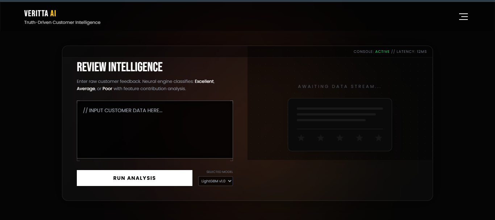

# 🚀 Veritta AI — Sentiment Intelligence & Explainable Review Analysis Platform

> **An enterprise-styled sentiment analysis console combining ML-driven classification, linguistic preprocessing, explainable AI heuristics, and real-time visualization for customer feedback intelligence.**

---

## **Live Application**

**Explore the deployed ***Veritta-AI*** a sentiment intelligence system designed to analyze, normalize and visualize customer opinions using the classical NLP pipelines.**

[](https://veritta-ai.onrender.com)

---

## **Dataset Source:**
```bash
https://www.kaggle.com/datasets/nelgiriyewithana/mcdonalds-store-reviews
```

> **This project utilizes the McDonald's Store Reviews dataset published on Kaggle. The dataset consists of publicly available customer reviews and ratings collected from Google Reviews for McDonald’s locations across the United States. Full credit goes to the original dataset author for collecting and sharing the data. This openly available dataset enabled the development, training, and demonstration of the sentiment analysis system presented in this project.**

---
## 🧩 Overview

> **Veritta AI is a sentiment intelligence system designed to **inspect, classify, and explain customer reviews** with a strong emphasis on transparency and UX realism.**

## The platform integrates

- **A tuned LightGBM classifier**

- **TF-IDF–based NLP feature extraction**

- **Deep linguistic preprocessing using NLTK**

- **Explainability layers inspired by SHAP-style attribution**

- **A high-fidelity, enterprise-grade UI built entirely in TailwindCSS**

> **This project is intentionally architected and documented as a product-style console, not a toy demo, mirroring how internal ML-driven insight tools appear in real organizations.**

---

## **🎯 Design Intent & Project Philosophy**

> **In applied data science and machine learning, many projects often converge on the same datasets, models, and evaluation metrics.**  

> **While model performance remains important, real-world impact depends equally on how insights are communicated, explored, and trusted**.

> **The deliberate focus on a **polished, system-level UI** in this project was intentional.**

> **Beyond model accuracy, this project was an opportunity to go beyond standard implementations and invest additional effort into **presentation, interaction, and system completeness** — areas that are frequently underrepresented in academic or tutorial-style projects.**

### **The design choices were made to:**

> **Reflect how ML insights are consumed inside real organizations through dashboards and internal tools rather than notebooks.**

> **Demonstrate that applied data science involves **product thinking**, not only algorithm selection.**

> **Treat explainability and user trust as first-class concerns rather than optional additions.**

> **Elevate the project from a typical model demonstration to a complete, user-facing intelligence system.**

> **This philosophy aligns with the belief that **engineers who aim to grow beyond baseline implementations must be willing to invest extra effort where it meaningfully improves clarity, usability, and trust**, not only raw metrics.Production-facing ML systems succeed when interpretability, usability, and engineering discipline receive the same level of attention as accuracy.**


---

## **🧠 Core Capabilities**

### **1. ML-Based Sentiment Classification**

> Customer reviews are classified into **EXCELLENT**, **AVERAGE**, or **POOR** categories.

- **LightGBM model trained on domain-relevant customer reviews**
- **TF-IDF vectorization of cleaned textual inputs**
- **Confidence scoring derived from prediction probabilities**
- Robust handling for missing probability outputs**

---

### **2. Advanced NLP Preprocessing Pipeline**

> **Ensures higher semantic signal quality before inference.**

**The preprocessing stage includes:**

- **Lowercasing & regex-based character cleanup**  

- **Tokenization via NLTK**

- **English stopword removal**

- **POS tagging**  

- **WordNet-based lemmatization with POS awareness**  

> **This pipeline improves both ***model performance*** and ***interpretability*** consistency**. 

---

### **3. Explainable AI (XAI) Layer — Neural Breakdown**

> ***Designed to expose **why** the model arrived at a decision.**

- **SHAP-style ***local feature attribution*** simulation**

- **Positive and negative word contribution detection**

- **Domain-specific lexicons tuned for customer-service language**

> **Visual impact scores displayed as:**

- **Token pills**

- **Contribution force plots**

- **Token contribution matrices**

> **The explainability layer prioritizes ***user intuition***, not just raw math.**

---

### **4. Negation-Aware Linguistic Intelligence**

> **Prevents common NLP misclassifications.**

> **The system intelligently detects negation context:**

- **“not friendly” → treated as **negative**

- **“never helpful” → polarity correctly flipped**

> **This minimizes false positives commonly seen in naive keyword systems.**

---

### **5. Real-Time Interactive UI Console**

> **Built to feel like an internal analytics tool.**

### **Key UI characteristics:**

- **Split-pane analyzer & visualization console**

- **Neural “scan” animation for inference realism**

- **Interactive sentiment reveal with confidence gauges**

- **Expandable deep-dive explainability views**

- **Fully responsive layout (desktop-first, mobile-safe)**

---

### **6. Sample Injection & Smart Filtering Simulation**

> **Demonstrates how production systems protect pipelines.**

- **Fetches verified samples from a backend CSV source**

- **Simulates profanity/toxic review detection**

- **Discards unsafe samples and refetches clean data**

- **Entire flow is visually communicated to the user**

> **This is an intentional UX decision to showcase *defensive ML system design**.

---

### **7. Analytics Dashboard & Local Persistence**

> **Enables lightweight behavioral analytics without servers.**

- **Review history stored in localStorage.**
  
- **Real-time sentiment distribution charts (Chart.js)**

- **Live-feed simulation toggle**

- **Aggregated sentiment statistics**

- **Recent review activity table with metadata**

- **No user data ever leaves the browser environment.**

---

## **🔒 Privacy & Ethics**

- **No reviews are stored on a server**

- **No external logging**

- **All history resides locally in the browser**

- **Predictions are probabilistic, not factual**

- **Tool is **not** intended as a source of absolute truth**

**Clear disclaimers are surfaced directly in the UI.**

---

## **🛠 Tech Stack**

### **Backend**

- **Python 3**

- **Flask**

- **LightGBM (trained & serialized)**

- **TF-IDF Vectorizer (Joblib/Pickle)**

- **Pandas**

- **NLTK (tokenization, POS tagging, lemmatization)**

### **Frontend**

- **HTML5**

- **TailwindCSS (custom-configured)**

- **Vanilla JavaScript**

- **Chart.js (visual analytics)**

- **Google Fonts (Bebas Neue, Poppins)**

---

## 📁 **Project File Structure**

| File / Folder | Description |
|---------------|------------|
| `Data/` | Contains datasets used for training and sampling |
| └── `Sample/` | Curated and cleaned sample datasets |
| &nbsp;&nbsp;&nbsp;&nbsp;└── `samples.csv` | Final balanced dataset used for inference and demos |
| └── `McDonald_s_Reviews.csv` | Original raw customer review dataset |
| `Models/` | Saved machine learning artifacts |
| ├── `lgb_tuned.pkl` | Trained LightGBM sentiment classification model |
| └── `tfidf_vectorizer.pkl` | TF-IDF vectorizer for text feature extraction |
| `Output/` | Generated outputs and UI assets |
| └── `Ui.png` | Application UI screenshot |
| `templates/` | HTML templates for Flask frontend |
| ├── `index.html` | Main web interface for sentiment analysis |
| └── `Ui2.html` | Alternative / experimental UI layout |
| `.gitignore` | Git ignore rules for environment files and cache |
| `app.py` | Flask backend application (Gunicorn entry point) |
| `streamlit_app.py` | Streamlit-based frontend application |
| `Dockerfile` | Docker configuration for containerized deployment |
| `McDonalds_Review_Classifier_Model_Development.ipynb` | Model training, evaluation, and tuning notebook |
| `package_extractor.py` | Utility script for dependency and package extraction |
| `requirements.txt` | Python dependencies required to run the project |
| `README.md` | Project documentation and usage guide |

---

## **⚙️ Installation & Usage**

### **1. Install dependencies**
```bash
pip install flask pandas nltk scikit-learn lightgbm
```

---

### **2. Ensure NLTK resources are available**
```bash
nltk.download('punkt')
nltk.download('stopwords')
nltk.download('wordnet')
nltk.download('averaged_perceptron_tagger')
nltk.download('omw-1.4')

```

---

### **3. Run the application**

```bash
cd MCDONALDS-REVIEW-SENTIMENT-CLASSIFIER-NLP-main`
```
```bash
python app.py
```

---

### **4. Open in browser**

```bash
http://127.0.0.1:5000

```

---

### **🧠 Inference Flow**

- **Raw review input received**
  
- **Linguistic preprocessing pipeline applied**

- **TF-IDF feature transformation**

- **LightGBM classification**

- **Confidence estimation**

- **Local explanation generation**

- **Interactive visualization rendered**

> **This layered flow mirrors how real-world ML products separate concerns between inference, explanation, and presentation.**

---


### **⚠️ Limitations:**

- **SHAP values are simulated (heuristic-based), not computed via full explainer objects.**

- **Model accuracy depends on training data quality.**

- **Domain-specific (customer service / fast-food context).**

- **Not intended for autonomous business decisions**

> **These constraints are explicitly acknowledged by design.**

---
## **Ouput**

> **System Interface Preview**  
> 


---

### **🏁 Conclusion:** 

> **Veritta AI is a demonstration of how machine learning, explainability, and UX can be unified into a credible, enterprise-style intelligence console.**

## **It is ideal for:**

- **ML & NLP portfolio demonstrations**

- **Explainable AI teaching examples**

- **UI/ML integration showcases**

- **Early-stage product simulations**
 
> **The documentation intentionally reflects the depth and seriousness of the system it represents.**
 
---

## **Source Availiability**

> **The core source implementation for this project is maintained in a private repository.**

> **The code can be shared upon request for review or evaluation purposes.**


---
## **📜 License**

This project is open-source and licensed under the [Apache License 2.0](../LICENSE).
See the LICENSE file for full details.

---

# **👤 Author:  Nayan Darokar** 
> **Data Scientist (Aspiring) | Intelligent Systems & Applied ML Engineering**

---

> **Connect With Me Here:**

[](https://www.linkedin.com/in/nayan-darokar-468a85294/) 
[](mailto:reachout.nayan@gmail.com)
[](https://nayan-portfolio-nine.vercel.app/)


